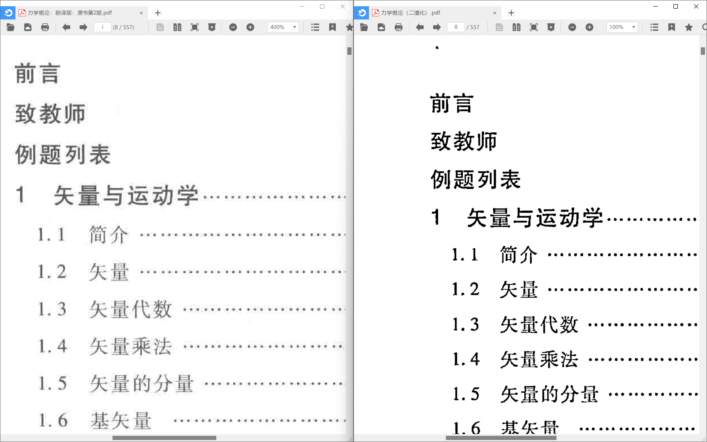
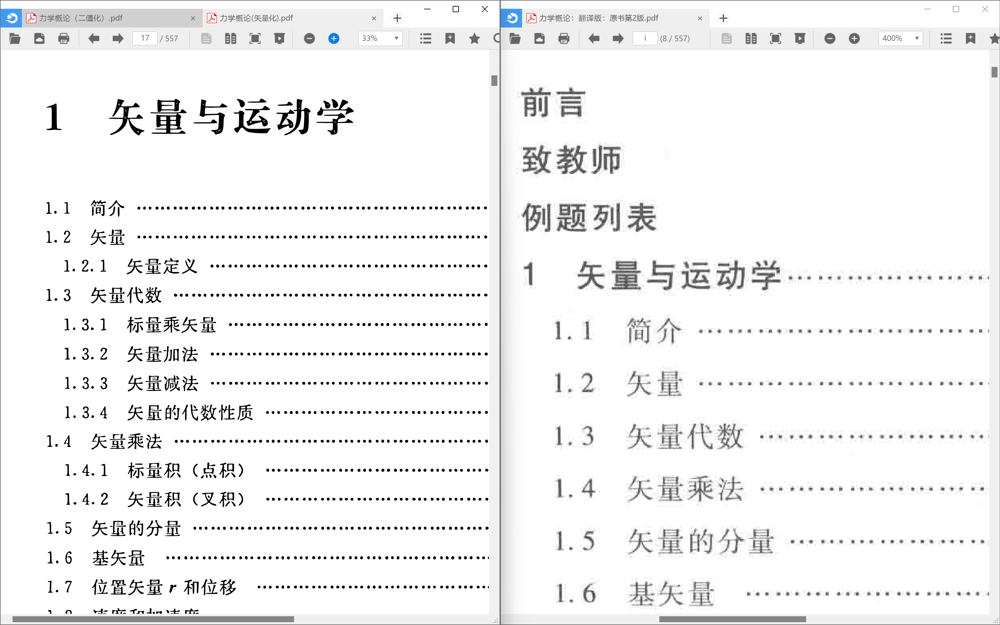

# improve-pdf

## 介绍：

使用python脚本对pdf进行优化，提高pdf清晰度，使文字更加清晰，观感更佳。仅适用黑白扫描版pdf，且文字较清晰，若模糊会更加模糊。

## 原理：

pdf转成png图片  
再使用opencv对图片局部阈值二值化处理  
并去除孤立噪点，优化图片观感  
最后转回pdf并合并，最终达到优化提高pdf清晰度的目的  
（可选）使用potrace处理png转成svg矢量图，使文字线条平滑，观感大幅度提高，接近ocr pdf 。

## 脚本使用方法：

### 1.安装依赖

```opencv
pip install opencv-python
```

```pymupdf
pip install pymupdf
```

### 2.将pdf文件放入文件夹中，将doc_path改为pdf文件路径(*不要使用中文路径，会报错*)

```python
doc_path = r"your pdf path"  # 相对路径删去r
```

### 3.运行脚本

推荐使用单任务多进程，默认满核运行处理速度更快，可自行修改，注意进程数不要超过cpu核心数

## 效果展示

### 二值化



### portrace矢量化（脚本未集成，可自行下载处理二值化图片体验）


